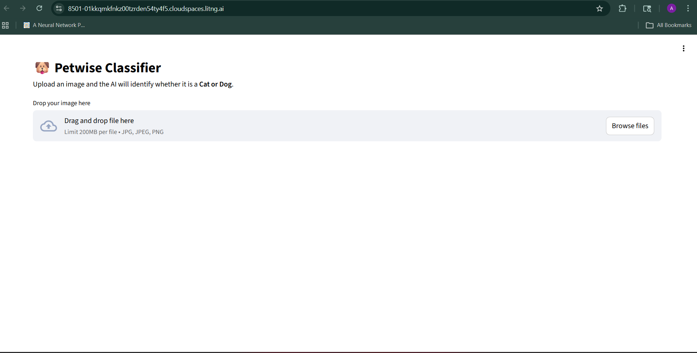
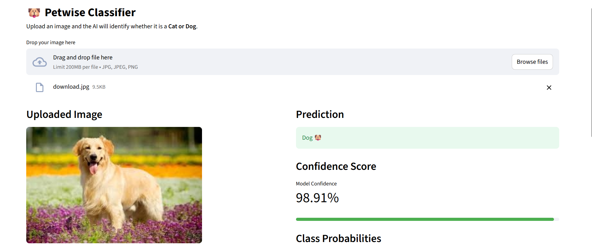

# 🐶🐱 Dog vs Cat Image Classifier


---

## 📌 Project Overview

This project is a **Deep Learning-based Image Classifier** that predicts whether an input image is a **Dog 🐶 or Cat 🐱** using a Convolutional Neural Network (CNN).

The model is trained on a Kaggle dataset and deployed as a web application using Streamlit for real-time predictions.

---

## 🚀 Features

* 🧠 CNN-based deep learning model
* 📷 Image upload for prediction
* ⚡ Real-time classification
* ☁️ Cloud-based training using Lightning AI
* 🌐 Web app deployment with Streamlit

---

## 🖼️ Demo

### 📸 App Interface



### 📊 Prediction Example



> 📌 *Note: Add your screenshots inside the `images/` folder*

---

## ⚙️ Tech Stack

* **Programming Language:** Python
* **Deep Learning:** TensorFlow / Keras
* **Frontend:** Streamlit
* **Libraries:** NumPy, PIL
* **Cloud Platform:** Lightning AI

---

## 📂 Project Structure

```
dog-vs-cat-image-classifier/
│
├── dataset/
├── model/
│     └── cnn_model.h5
│
├── app.py
├── predict.py
├── train.py
│
├── images/
│     ├── app.png
│     └── prediction.png
│
├── requirements.txt
└── README.md
```

---

## 🧠 Model Architecture

* Convolutional Layers (Feature Extraction)
* MaxPooling Layers (Dimensionality Reduction)
* Fully Connected Layers (Classification)

---

## 📊 Dataset

* Source: Kaggle (Dogs vs Cats Dataset)
* Preprocessed and resized to 150x150
* Split into training and testing sets

---

## ⚡ How to Run Locally

### 1️⃣ Clone Repository

```
git clone https://github.com/your-username/dog-vs-cat-image-classifier.git
cd dog-vs-cat-image-classifier
```

### 2️⃣ Install Dependencies

```
pip install -r requirements.txt
```

### 3️⃣ Run App

```
streamlit run app.py
```

---

## ☁️ Deployment

* Model trained using **Lightning AI** (high-performance cloud environment)
* Web app deployed using **Streamlit**

---

## 🎯 Future Improvements

* Improve accuracy using data augmentation
* Add more classes (multi-class classification)
* Deploy using Docker

---

## 🙌 Author

**Akash Kumar**

* Aspiring Data Scientist 🚀

---

## ⭐ Show Your Support

If you like this project, give it a ⭐ on GitHub!
